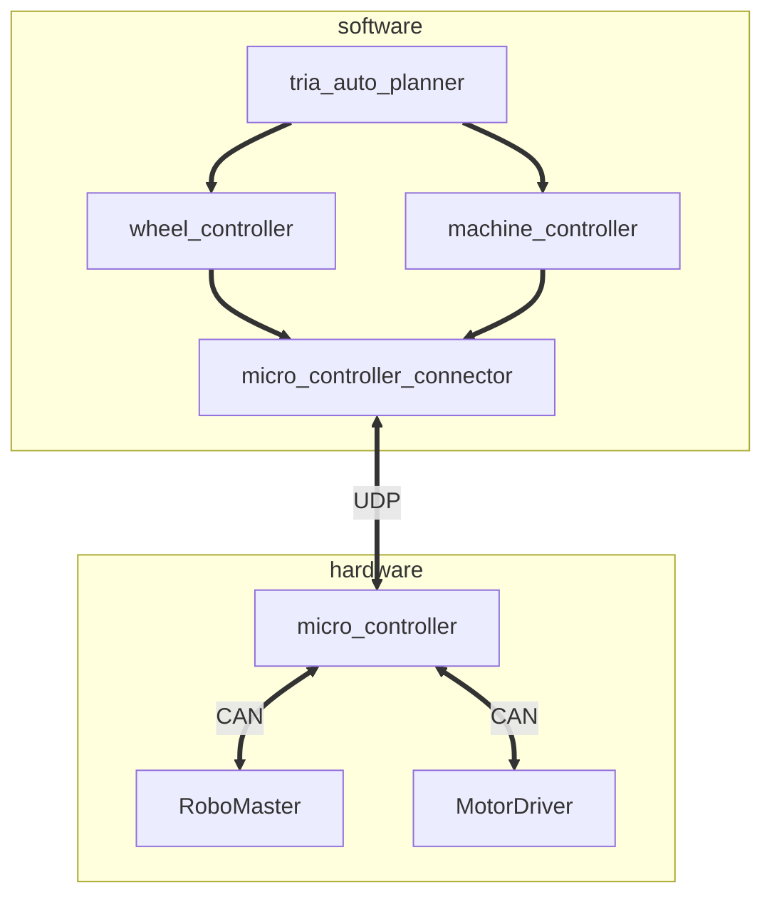

# 制御アーキテクチャ

```mermaid
graph TD

subgraph hardware
micro_controller <==> |CAN| RoboMaster
micro_controller <==> |CAN| MotorDriver
end

subgraph software
micro_controller_connector <==>|UDP| micro_controller
wheel_controller ==> micro_controller_connector
machine_controller ==> micro_controller_connector
tria_auto_planner ==> wheel_controller
tria_auto_planner ==> machine_controller
end
```